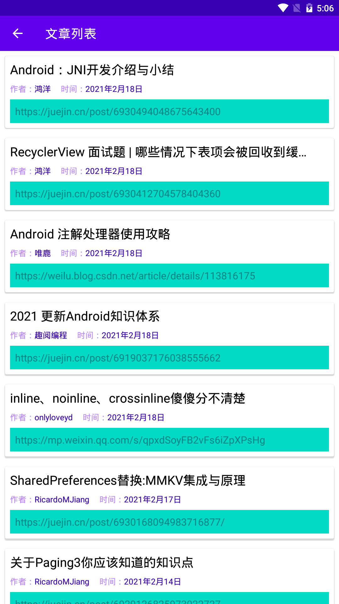

### 项目介绍
项目主要是用于学习 jetpack 中的各种库。由于我也是刚开始系统的学习 Jetpack，如有错误的地方，还望指正。
对于 Jetpack 的每个库，都会用写一个小的 demo 来练手。

### paging
> 有个官方的例子，但是看着还是比较蛋疼的，它是让你自己慢慢的改一个老项目
- 官方例子：https://developer.android.com/codelabs/android-paging#0

使用的是 Paging3。主要是写了一个分页的列表，采用 WanAndroid 的开放 API。
例子中的唯一难点，是让 SmartRefreshLayout 与 Paging3 结合起来，因为 Paging3 暴露出来给开发者的 API 是想让
开发者自己实现头部与尾部。但是 SmartRefreshLayout 自己是自带头部与尾部的，所以会有一点冲突，我的解决方案是监听
PagingDataAdapter 的状态变化，然后利用这个状态变化来驱动 SmartRefreshLayout 的头部与尾部。

### 使用的技术栈
kotlin

viewBinding (视图绑定)
介绍：https://developer.android.com/topic/libraries/view-binding

hilt (依赖注入)
介绍：https://mp.weixin.qq.com/s/OEX1d2cU1zGG5BBM-nANBg

Retrofit (网络框架)
介绍：https://square.github.io/retrofit/